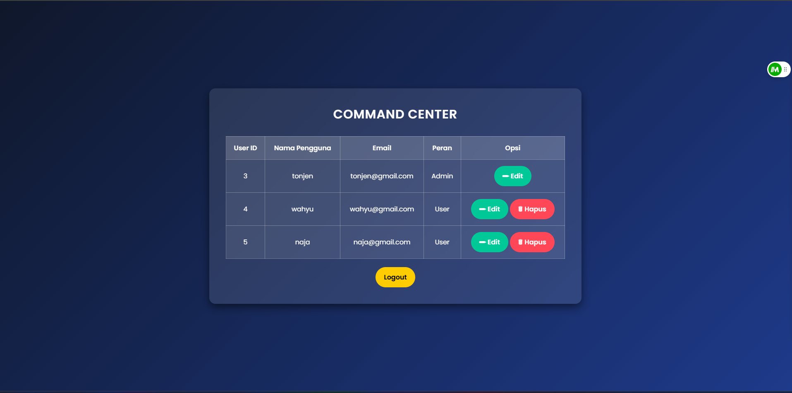
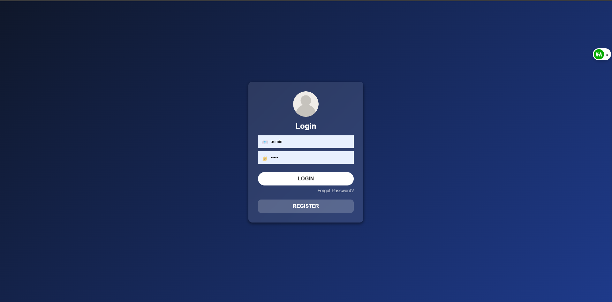

# Web Task

## 🚀 Fitur
- Login
- Register
- Login mau sebagai admin atau user
- Register akun mau menjadi sebagai user atau admin
- jika login sebagai admin bisa melihat tampilan dashboard user dan admin, dan bisa mengedit atau menghapus user.
- jika login sebagai user langsung diarahkan ke dashboard profile

## 🛠️ Teknologi yang Digunakan
- **PhpMyadmin**
- **MySQL** 
- **HTML** 
- **CSS** 

## 📸 Screenshot
### Halaman Admin

### Halaman Register

### Edit User

### Hapus User

### Halaman Login

### Halaman User

## 🤝 Kontribusi
Jika ingin berkontribusi, silakan fork repository ini dan ajukan pull request.

---
by Muhammad Hafiz
